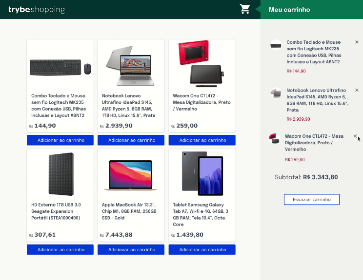

# Front-end-Online-Store
Website de uma loja que utiliza de requisições a API para retornar uma lista de produtos de acordo com uma categoria. É possível adicioná-los ao carrinho e colocar uma avaliação.

O projeto foi desenvolvido em grupo para, além de consolidar os conceitos técnicos, exercitar as habilidades de comunicação e colaboração.

